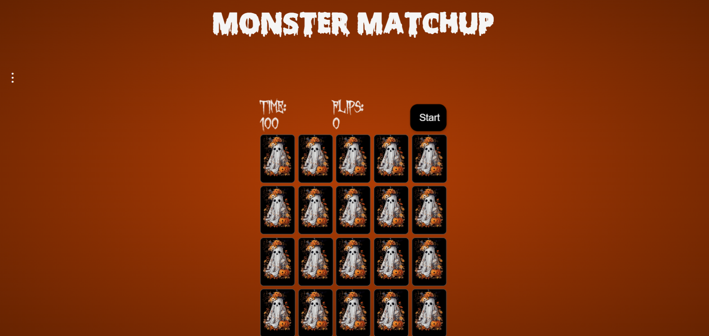

# Halloween Memory Matching Game
The Halloween Memory Matching Card Game is a web-based game that tests your memory skills 
with a fun Halloween twist. Match pairs of spooky-themed cards to win! The game features 
a countdown timer and smooth animations to keep the gameplay engaging.

&nbsp;

&nbsp;

## Game Functionality
Start Game: Click the "Start" button to shuffle and reveal the cards. 
Menu: Choose from 5 different background themes. 
Card Flipping: Click on cards to reveal their images. Match pairs to keep them face up. 
Timer: A countdown timer adds urgency to the game, starting from 100 seconds. 
Flips: Keeps track of the number of flips you aquired in order to win. 
End Game: The game concludes when all pairs are matched or the timer reaches zero. 
Replay: Click replay to try again.

&nbsp;

## File Structure
index.html: The main HTML file that sets up the game structure. 
styles.css: Contains the styling for the game, including card designs and responsive layout. 
script.js: Implements the game logic, including card flipping, matching, and timer functionality. 
theme.js: Implements different themes users can choose from.

&nbsp;

## Features
Smooth Animations: Enjoy fluid transitions when flipping cards and shuffling. 
User Feedback: Visual cues for matches, game over, and flipping the cards.

&nbsp;

## Getting Started
Access the game [here] (https://kvanderhill.github.io/HalloweenMemGame/)

